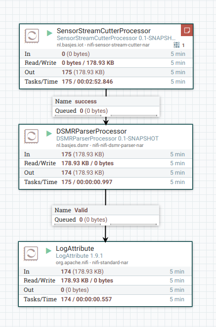

Status: Unstable, work in progress, DO NOT USE ... (yet)
===

DSMR Toolkit
====
DSMR are the Dutch Smart Meter Requirements; part of these requirements are the messages sent out via the P1 port that can be captured and processed on a computer.

Many tools already exist to do this but so far I have not found one that allows me to easily select the system the messages are to be sent to.

This is going to be a set of Java based libraries and UDFs that should allow processing DSMR messages in a way that is as flexible and reuable as possible.
As part of this there will be a few Nifi processors in order to support this flexibility.
  
...

First Demonstration
====
In order to more easily test this software I have created a DSMR-Simluator.
When you run this a named pipe is created that sends out data that is totally fake (most values are either constant or change via a sin function) yet behaves 'similar' to real data from the perspective of a system that should be able to interpret this data.

When I run Apache Nifi and create and run this flow:

I see this output in the nifi-app.log

    2019-04-13 14:06:54,026 INFO [Timer-Driven Process Thread-9] o.a.n.processors.standard.LogAttribute LogAttribute[id=03c261b4-016a-1000-eebf-e44ae997b02c] logging for flow file StandardFlowFileRecord[uuid=c3bf8c1a-5cc7-4d84-9a19-15ac15c6d7c4,claim=StandardContentClaim [resourceClaim=StandardResourceClaim[id=1554840833533-1, container=default, section=1], offset=474396, length=1053],offset=0,name=c3bf8c1a-5cc7-4d84-9a19-15ac15c6d7c4,size=1053]
    --------------------------------------------------
    Standard FlowFile Attributes
    Key: 'entryDate'
        Value: 'Sat Apr 13 14:06:54 CEST 2019'
    Key: 'lineageStartDate'
        Value: 'Sat Apr 13 14:06:54 CEST 2019'
    Key: 'fileSize'
        Value: '1053'
    FlowFile Attribute Map Content
    Key: 'dsmr.crc'
        Value: '370D'
    Key: 'dsmr.currentL1'
        Value: '4.0'
    Key: 'dsmr.currentL2'
        Value: '7.0'
    Key: 'dsmr.currentL3'
        Value: '5.0'
    Key: 'dsmr.electricityPowerReceived'
        Value: '0.765'
    Key: 'dsmr.electricityPowerReturned'
        Value: '1.235'
    Key: 'dsmr.electricityReceivedLowTariff'
        Value: '741.221'
    Key: 'dsmr.electricityReceivedNormalTariff'
        Value: '858.779'
    Key: 'dsmr.electricityReturnedLowTariff'
        Value: '941.221'
    Key: 'dsmr.electricityReturnedNormalTariff'
        Value: '1058.779'
    Key: 'dsmr.electricityTariffIndicator'
        Value: '2.0'
    Key: 'dsmr.equipmentId'
        Value: 'E1234567890'
    Key: 'dsmr.gasEquipmentId'
        Value: 'G1234567890'
    Key: 'dsmr.gasM3'
        Value: '12785.123'
    Key: 'dsmr.gasTimestamp'
        Value: '2010-12-09T11:25:00+01:00'
    Key: 'dsmr.ident'
        Value: '/ISk5\2MT382-1000'
    Key: 'dsmr.longPowerFailures'
        Value: '2'
    Key: 'dsmr.mbus.1.deviceType'
        Value: '003'
    Key: 'dsmr.mbus.1.equipmentId'
        Value: 'G1234567890'
    Key: 'dsmr.mbus.1.timestamp'
        Value: '2010-12-09T11:25:00+01:00'
    Key: 'dsmr.mbus.1.unit'
        Value: 'm3'
    Key: 'dsmr.mbus.1.value'
        Value: '12785.123'
    Key: 'dsmr.message'
        Value: 'DSMR simulator created by Niels Basjes. See https://dsmr.basjes.nl for more information.'
    Key: 'dsmr.p1Version'
        Value: '50'
    Key: 'dsmr.powerFailures'
        Value: '4'
    Key: 'dsmr.powerReceivedL1'
        Value: '0.765'
    Key: 'dsmr.powerReceivedL2'
        Value: '1.765'
    Key: 'dsmr.powerReceivedL3'
        Value: '2.765'
    Key: 'dsmr.powerReturnedL1'
        Value: '3.765'
    Key: 'dsmr.powerReturnedL2'
        Value: '4.765'
    Key: 'dsmr.powerReturnedL3'
        Value: '5.765'
    Key: 'dsmr.timestamp'
        Value: '2019-04-13T14:06:54+02:00'
    Key: 'dsmr.validCRC'
        Value: 'true'
    Key: 'dsmr.voltageL1'
        Value: '219.2'
    Key: 'dsmr.voltageL2'
        Value: '223.8'
    Key: 'dsmr.voltageL3'
        Value: '219.5'
    Key: 'dsmr.voltageSagsPhaseL1'
        Value: '2'
    Key: 'dsmr.voltageSagsPhaseL2'
        Value: '1'
    Key: 'dsmr.voltageSagsPhaseL3'
        Value: '0'
    Key: 'dsmr.voltageSwellsPhaseL1'
        Value: '0'
    Key: 'dsmr.voltageSwellsPhaseL2'
        Value: '3'
    Key: 'dsmr.voltageSwellsPhaseL3'
        Value: '0'
    Key: 'filename'
        Value: 'c3bf8c1a-5cc7-4d84-9a19-15ac15c6d7c4'
    Key: 'path'
        Value: './'
    Key: 'uuid'
        Value: 'c3bf8c1a-5cc7-4d84-9a19-15ac15c6d7c4'
    --------------------------------------------------
    /ISk5\2MT382-1000
    
    1-3:0.2.8(50)
    0-0:1.0.0(190413140654S)
    0-0:96.1.1(4531323334353637383930)
    1-0:1.8.1(00741.221*kWh)
    1-0:1.8.2(00858.779*kWh)
    1-0:2.8.1(00941.221*kWh)
    1-0:2.8.2(01058.779*kWh)
    0-0:96.14.0(0002)
    1-0:1.7.0(0.765*kW)
    1-0:2.7.0(1.235*kW)
    0-0:96.7.21(00004)
    0-0:96.7.9(00002)
    1-0:99.97.0(2)(0-0:96.7.19)(101208152415W)(0000000240*s)(101208151004W)(0000000301*s)
    1-0:32.32.0(00002)
    1-0:52.32.0(00001)
    1-0:72.32.0(00000)
    1-0:32.36.0(00000)
    1-0:52.36.0(00003)
    1-0:72.36.0(00000)
    0-0:96.13.0(44534D522073696D756C61746F722063726561746564206279204E69656C73204261736A65732E205365652068747470733A2F2F64736D722E6261736A65732E6E6C20666F72206D6F726520696E666F726D6174696F6E2E)
    1-0:32.7.0(219.2*V)
    1-0:52.7.0(223.8*V)
    1-0:72.7.0(219.5*V)
    1-0:31.7.0(004*A)
    1-0:51.7.0(007*A)
    1-0:71.7.0(005*A)
    1-0:21.7.0(0.765*kW)
    1-0:41.7.0(1.765*kW)
    1-0:61.7.0(2.765*kW)
    1-0:22.7.0(3.765*kW)
    1-0:42.7.0(4.765*kW)
    1-0:62.7.0(5.765*kW)
    0-1:24.1.0(003)
    0-1:96.1.0(4731323334353637383930)
    0-1:24.2.1(101209112500W)(12785.123*m3)
    !370D

LICENSE
===

   Copyright 2019 Niels Basjes

   Licensed under the Apache License, Version 2.0 (the "License");
   you may not use this file except in compliance with the License.
   You may obtain a copy of the License at

       https://www.apache.org/licenses/LICENSE-2.0

   Unless required by applicable law or agreed to in writing, software
   distributed under the License is distributed on an "AS IS" BASIS,
   WITHOUT WARRANTIES OR CONDITIONS OF ANY KIND, either express or implied.
   See the License for the specific language governing permissions and
   limitations under the License.
