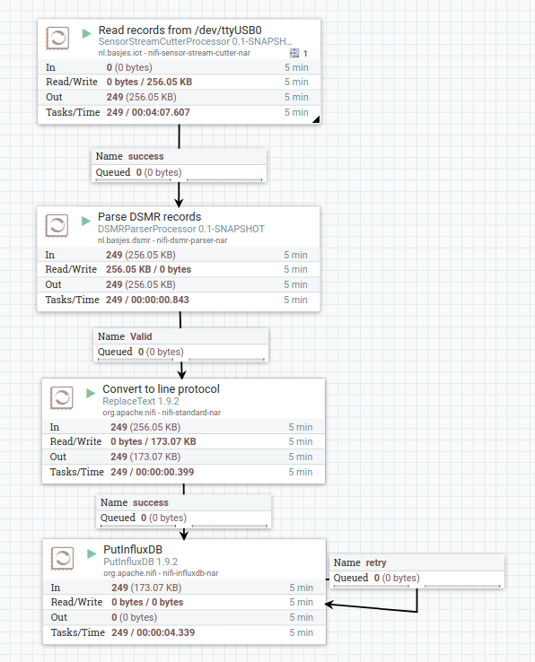
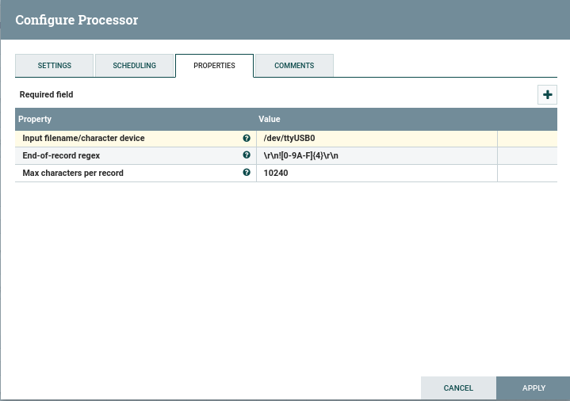
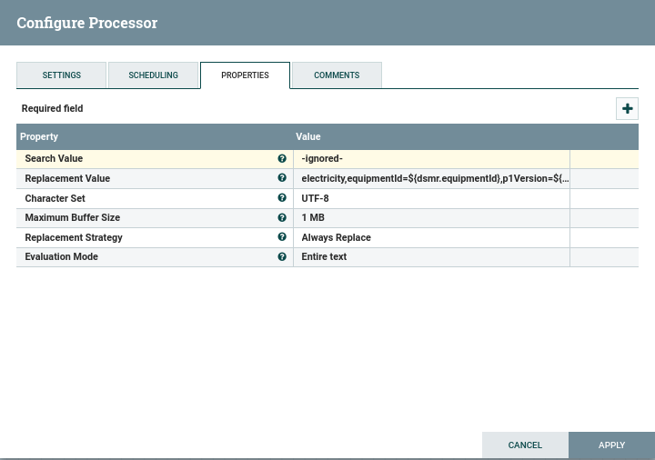
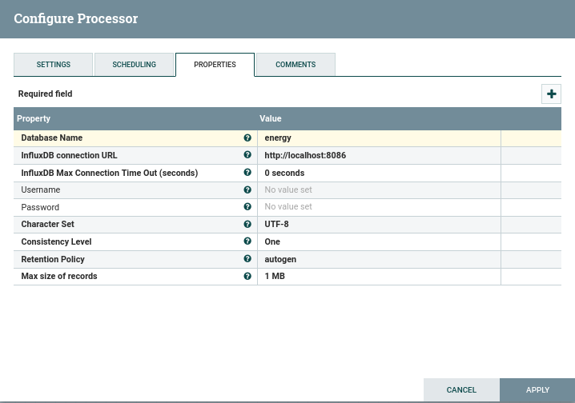
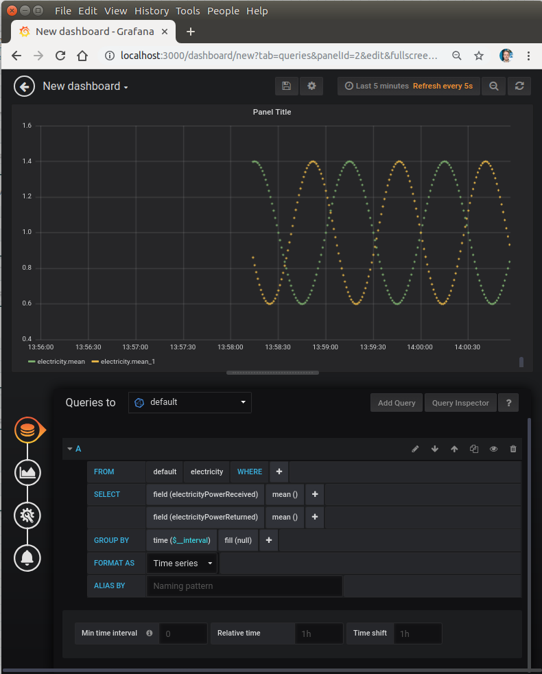

# Status: Works on my machine ... will probably melt yours ...

# DSMR Toolkit
DSMR are the Dutch Smart Meter Requirements; part of these requirements are the messages sent out via the P1 port that can be captured and processed on a computer.

Many tools already exist to do this but so far I have not found one that allows me to easily select the system the messages are to be sent to.

This is a set of Java based libraries and tools that should allow processing DSMR messages in a way that is as flexible and reusable as possible.

Parts in this toolkit:

- *DSMR-Simulator*
  - A local application that creates a local "named pipe" which outputs data in the DSMR format. The data itself is totally fake (you get nice sine wave patterns) and is intended for tesing a pipeline on your development system.
- *Stream record splitter*
  - A library that can read an endless UTF8 string from a file/character device and output substrings that are cut by means of a regex that describes what the end of a record looks like.
- *DSMR-Parser*
  - A library that is able to parse a string that is in the DSMR telegram format.
- *Apache Nifi UDFs*
  - For the both the "Stream record splitter" and the "DSMR-Parser" a Nifi Processor has been created to allow using them inside Apache Nifi.
- *DSMR to InfluxDb*
  - MiNifi is great in terms of flexibility and bad in terms of startup time on a Raspberry Pi. So in addition I created a very simple Java application that ONLY does the DSMR to InfluxDb flow in a hard coded way (starts in 5 seconds instead of 3 minutes).

## Important system config settings

The USB serial MUST be set to the right speed (115200 in my case) and set to 'raw' or the crc checksum will NEVER match.

    stty -F /dev/ttyUSB0 115200 raw

# A basic (Mi)Nifi Flow
After building and installing the processors in this project in a (local) Apache Nifi installation you can build this very simple flow which simply read and parses the data from the P1 port of the smart meter and stores everything in InfluxDb.

Using Nifi I have created a template of this ([DSMR-to-InfluxDb.xml](docs/DSMR-to-InfluxDb.xml)) as a testing reference:

The steps in there:

## Stream splitter: Read the records from the stream
- Read from /dev/ttyUSB0
- Split stream in records using this 'DSMR CRC pattern': \r\n![0-9A-F]{4}\r\n

## DSMR Parser: Parse the records
- No config needed, this just parses the input content and creates a lot of extra attributes for the flowfile.

## ReplaceText: Convert into the InfluxDB "line protocol"
- Evaluation Mode: Entire text
- Replacement strategy: Always replace
- Replacement value:

      electricity,equipmentId=${dsmr.equipmentId},p1Version=${dsmr.p1Version} electricityReceivedLowTariff=${dsmr.electricityReceivedLowTariff},electricityReceivedNormalTariff=${dsmr.electricityReceivedNormalTariff},electricityReturnedLowTariff=${dsmr.electricityReturnedLowTariff},electricityReturnedNormalTariff=${dsmr.electricityReturnedNormalTariff},electricityTariffIndicator=${dsmr.electricityTariffIndicator},electricityPowerReceived=${dsmr.electricityPowerReceived},electricityPowerReturned=${dsmr.electricityPowerReturned},powerFailures=${dsmr.powerFailures}i,longPowerFailures=${dsmr.longPowerFailures}i,voltageSagsPhaseL1=${dsmr.voltageSagsPhaseL1}i,voltageSagsPhaseL2=${dsmr.voltageSagsPhaseL2}i,voltageSagsPhaseL3=${dsmr.voltageSagsPhaseL3}i,voltageSwellsPhaseL1=${dsmr.voltageSwellsPhaseL1}i,voltageSwellsPhaseL2=${dsmr.voltageSwellsPhaseL2}i,voltageSwellsPhaseL3=${dsmr.voltageSwellsPhaseL3}i,voltageL1=${dsmr.voltageL1},voltageL2=${dsmr.voltageL2},voltageL3=${dsmr.voltageL3},currentL1=${dsmr.currentL1},currentL2=${dsmr.currentL2},currentL3=${dsmr.currentL3},powerReceivedL1=${dsmr.powerReceivedL1},powerReceivedL2=${dsmr.powerReceivedL2},powerReceivedL3=${dsmr.powerReceivedL3},powerReturnedL1=${dsmr.powerReturnedL1},powerReturnedL2=${dsmr.powerReturnedL2},powerReturnedL3=${dsmr.powerReturnedL3} ${dsmr.timestamp.epochSecond}000000000

**Warning about the timestamp in this replacement value!**

The last field is the timestamp.
Here the time (in seconds) from the data of the energy meter is used (i.e. ${dsmr.timestamp.epochSecond}000000000 ).

The meter I have has a clock that is off by about 7 seconds, this causes nasty effects in Grafana when I try to add/substract these values form other data streams I have (like from my solar inverter).

If you have a similar situation then I recommend using this timestamp instead that uses the clock of the local system (which I have synchronized using NTP) and is rounded to the whole second:  **${now():toNumber():divide(1000)}000000000**

## PutInfluxDB: Store into InfluxDB
- Send the data to your local InfluxDB instance.

When I then hook Grafana to this Influx Db database and make a graph I get something like this:

# Running on a Raspberry Pi

I have a Raspberry Pi Model B Plus Rev 1.2 on which I have this running using Minifi 0.5.0.
In order to make it work I had to jump through some hoops.

## Dependencies
Now MiNiFi is REALLY picky about versions of nar files.

Because MiNiFi 0.5.0. is build against NiFi 1.7.0 you need to download that exact version because we need some additional libraries from it.

- Copy these from nifi to the minifi lib folder:
    - nifi-influxdb-nar-1.7.0.nar
    - nifi-standard-services-api-nar-1.7.0.nar
- Copy the two nars from this project (also built against Nifi 1.7.0!!) to the minifi lib folder:
    - nifi-sensor-stream-cutter-nar-0.1-SNAPSHOT.nar
    - nifi-dsmr-parser-nar-0.1-SNAPSHOT.nar

## There is no "disk"
The problem with Raspberry Pi systems is that they have an SD card as 'disk'.

*These suffer from wearing out quite fast.*

Also (Mi)NiFi writes a lot of stuff that I do not care about (like Provenance data).

To avoid disk related problems as much as possible I reduced the writing to only what is needed and created a RamDisk to run MiNiFi on.

### No Provenance for MiNiFi
So after converting the flow into the MiNiFi yaml format I changed this

    Provenance Repository:
      provenance rollover time: 1 min
      implementation: org.apache.nifi.provenance.MiNiFiPersistentProvenanceRepository

into

    Provenance Repository:
      provenance rollover time: 1 min
      implementation: org.apache.nifi.provenance.NoOpProvenanceRepository

To avoid writing the Provenance data (which I don't need).

### Create ramdisk

First create the actual directory/mount point:

    mkdir /minifi

Then in /etc/fstab I added this line to define a new 10MiB Ramdisk:

    tmpfs /minifi tmpfs nodev,nosuid,size=10M 0 0

and run

    mount -a

### Install/Run Minifi using the ramdisk

Now we put our MiNiFi setup somewhere on the SD card and we add this script as `run.sh`

    #/bin/bash
    DIR="$( cd "$( dirname "${BASH_SOURCE[0]}" )" >/dev/null 2>&1 && pwd )"
    RUNDIR=/minifi

    if [ ! -e ${RUNDIR}/bin/minifi.sh ];
    then
        mkdir ${RUNDIR}/bin
        cp ${DIR}/bin/*.sh ${RUNDIR}/bin
        chmod 755 ${RUNDIR}/bin/*.sh
        cp -rs ${DIR}/lib   ${RUNDIR}
        cp -rs ${DIR}/conf  ${RUNDIR}
        mkdir ${DIR}/work
        ln -s ${DIR}/work   ${RUNDIR}
    fi

    ${RUNDIR}/bin/minifi.sh start

This script will effectively make MiNiFi read the 'immutable' stuff from the SD card and read/write the fast changing stuff to the ramdisk.

# LICENSE: Apache 2.0

   Copyright 2019 Niels Basjes

   Licensed under the Apache License, Version 2.0 (the "License");
   you may not use this file except in compliance with the License.
   You may obtain a copy of the License at

       https://www.apache.org/licenses/LICENSE-2.0

   Unless required by applicable law or agreed to in writing, software
   distributed under the License is distributed on an "AS IS" BASIS,
   WITHOUT WARRANTIES OR CONDITIONS OF ANY KIND, either express or implied.
   See the License for the specific language governing permissions and
   limitations under the License.
